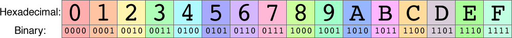
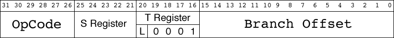
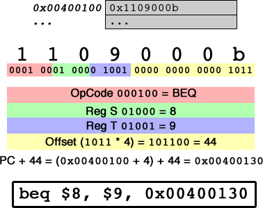

# CMPUT 229 Lab 2 - Hexadecimal and Branching

## Information

### Hexadecimal

The hexadecimal numbering system (base 16) is commonly used in computing science, due to its easy translation to/from binary. Compared to binary, hexadecimal is extremely succinct, representing 4 binary digits with a single hexadecimal digit. Unlike decimal, hexadecimal can be translated to binary digit by digit, with digits not affecting each other in the binary result.

  

Due to this direct correlation, the algorithm to convert a binary number from ASCII hexadecimal digits to a binary integer only involves converting the ASCII digit to the value it represents, and shifting left 4 before `or`ing in the next hexadecimal digit.

Going from a binary number to ASCII hexadecimal is similarly simple, involving masking out each 4-bit section and converting it to its associated ASCII character. A full table of ASCII characters can be found [here](http://www.asciitable.com).

### MIPS Branch Format

All MIPS branch instructions follow a particular format, which makes them trivial to decode by masking out their various fields. In MIPS, the format looks like this:

  

- **OpCode (bits 31-26):** the `OpCode` uniquely identifies a particular type of conditional branch, which also determines whether `bits 20-16` contain a second register or link bit.
- **S Register (bits 25-21):** this is the numerical identifier for register `$s` of a branch instruction.
- **T Register (bits 20-16):** on branches requiring two registers, this bitfield holds the second register, register `$t`.
- **Link Bit (L, bit 20):** this bit determines whether or not the contents of the `PC` are placed into `$ra` if the branch is taken. This behaviour is identical to that of `jal`.
- **Branch Offset (bits 15-0):** the branch offset is used to calculate the new value of the `PC` if the branch is taken. To calculate the destination address, the offset, which is in *words*, is multiplied by 4, and added to the current value of the `PC`. When this addition is performed, the `PC` is already pointing to the instruction located 4 bytes **below** the branch, so this is compensated for when originally calculating the branch offset.

### Branch Instructions

MIPS has the following branch instructions implemented. The register `s` is used to indicate the source register, `t` is used to indicate the target register, and `i` is used to indicate the branch offset.

| Instruction  | Binary |
| ------------- | ------------- |
| <tt>bgez $s, offset</tt> | <tt>0000 01ss sss0 0001 iiii iiii iiii iiii</tt>  |
| <tt>bgezal $s, offset</tt> | <tt>0000 01ss sss1 0001 iiii iiii iiii iiii</tt> |
| <tt>bltz $s, offset</tt> | <tt>0000 01ss sss0 0000 iiii iiii iiii iiii</tt> |
| <tt>bltzal $s, offset</tt> | <tt>0000 01ss sss1 0000 iiii iiii iiii iiii</tt> |
| <tt>beq $s, $t, offset</tt> | <tt>0001 00ss ssst tttt iiii iiii iiii iiii</tt> |
| <tt>bne $s, $t, offset</tt> | <tt>0001 01ss ssst tttt iiii iiii iiii iiii</tt> |
| <tt>blez $s, offset</tt> | <tt>0001 10ss sss0 0000 iiii iiii iiii iiii</tt> |
| <tt>bgtz $s, offset</tt> | <tt>0001 11ss sss0 0000 iiii iiii iiii iiii</tt> |

Any instruction that is not in this list will not need to be decoded, and is guaranteed not to share an `OpCode` with the instructions above. Further, if one of these `OpCode`s is in the instruction, it is guaranteed to be a valid instruction.

## Assignment

Your assignment is to disassemble MIPS branch instructions by implementing the function `disassembleBranch`, which follows the specification:

* **Arguments:** `$a0` contains the address of a MIPS assembly instruction.
* **Output:** If the instruction is not a MIPS branch instruction, **no** output is generated. If the instruction is a MIPS branch instruction, you must print out the instruction fully in lowercase, prefixing registers with `$`, separating registers and addresses with a comma and a space, only including register `$t` if it is used in the branch, and printing the absolute address of the branch target in `0xffffffff` form. For example, the decoding of the binary representation of `beq $t0, $t1, 44` is:

  

## Notes
Do not append a newline to the end of your printout.

## Resources

* Slides used for in-class introduction of the lab ([.pdf](resources/slides/class.pdf))
* Slides used for in-lab introduction of the lab ([.pdf](resources/slides/lab.pdf))
* Set of test cases: ([TestCaseSuite_Lab_2.tar.bz2](resources/code/TestCaseSuite_Lab_2.tar.bz2)). This is a tar.bz2 file. After downloading you can extract the directory containing the files using the command `tar -xf TestCaseSuite_Lab_2.tar.bz2`.

## Marking Guide

Here is the [mark sheet](MarkSheet.txt) used for grading. Assignments that are too short to be adequately judged for code quality will be given a zero. Register translation is vital for all instructions. Therefore, it is difficult for a binary translator that does not do correct register translation to pass *any* of the grading test cases. Please, ensure proper register translation according to the table above. Your submission will be evaluated as follows:

*   20% For code cleanliness, readability, and comments
*   40% For correctly implementing all branches, including hiding the $t register where needed
*   20% for correctly ignoring non-branching instructions
*   20% for correctly handling large branching offsets

## Submission

There is a single file to be submitted for this lab. The file name should be `lab2.s` and it should contain only the code for the function specified above. Make sure to not include a `main` function in your solution.

**Please make sure that you follow the link provided in the course eClass page for this lab assignment to get your own private GitHub repo for this lab. To ensure that we have the latest version of your solution, make sure to commit your changes to the repo frequently. Otherwise, you may forget to commit your latest changes by the deadline (which will count as a late lab, and will not be graded). Your solution will be automatically collected via GitHub Classroom by the deadline. Your solution MUST include the [CMPUT 229 Student Submission License](LICENSE.md) at the top of the file containing your solution and you must include your name in the appropriate place in the license text.**
